# Manual de usuario — Integración GRS

Panel de escritorio para operar la sincronización de resultados deportivos del evento **JJB2026** hacia el GRS. Cada deporte tiene su propia página; el **Dashboard** resume el estado de todos.

> **Glosario rápido**
> - **GRS**: el sistema central de resultados. Todo lo que se sincroniza termina ahí.
> - **Proveedor**: el sistema externo de cada deporte (Arena, Zempo, CBAT, IANSEO, SwimSystem, SportTech).
> - **Sync / sincronización**: traer datos del proveedor y guardarlos en el GRS.
> - **Auto-sync**: sincronización automática periódica. El intervalo se configura en **Configuración → Integraciones**; se enciende y apaga desde la tarjeta del deporte en el **Dashboard**.
> - **Setup**: pasos que crean la estructura del evento en el GRS (competiciones, fases, units) antes de sincronizar datos.

---

## 1. Inicio de sesión

Al abrir la app aparece la pantalla **Integración GRS**.

1. Ingresa tu **Usuario** y **Contraseña** (credenciales del GRS).
2. Pulsa **Iniciar sesión**.

Al pie del formulario se muestra la URL del GRS a la que se conecta.

**Si algo falla:**
- *"Credenciales inválidas"* → usuario o contraseña incorrectos.
- *"No se pudo conectar con el GRS. Revisa la URL en Configuración."* → el GRS no responde; verifica la URL en **Configuración → Conexiones** o que el servidor esté encendido.

La sesión queda guardada localmente: al reabrir la app no hace falta volver a entrar mientras el token siga vigente. Si el token expira, la app vuelve sola al login.

## 2. Navegación

La barra lateral izquierda tiene tres bloques:

| Bloque | Entradas |
|---|---|
| (arriba) | **Dashboard** — resumen de todos los deportes |
| **Deportes** | WRE (lucha) · JUD (judo) · ATH (atletismo) · ARC (tiro con arco) · SWM (natación) · GAR (artística) · GRY (rítmica) |
| **Sistema** | **Configuración** — conexiones e integraciones |

Abajo del todo: tu usuario, el botón **Modo claro / Modo oscuro** y **Cerrar sesión**.

## 3. Configuración

Todo lo configurable vive en **Configuración**, en dos secciones.

### 3.1 Conexiones

Dónde están los servicios y sus credenciales. Se guardan **en esta computadora** (no en el servidor).

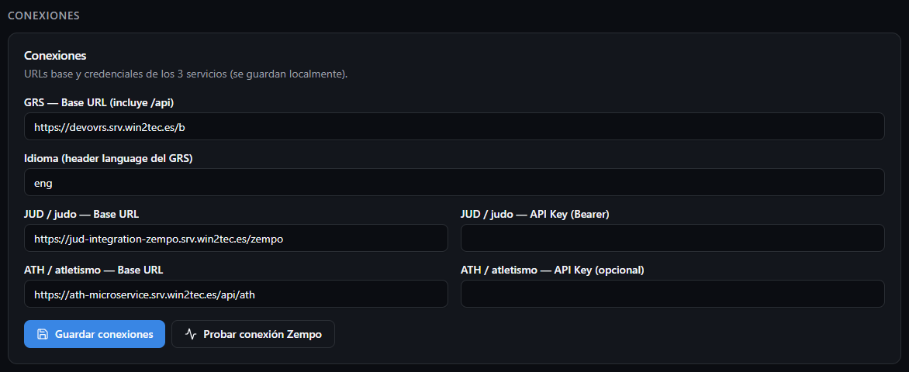

| Campo | Qué es |
|---|---|
| GRS — Base URL (incluye /api) | URL del GRS, p. ej. `http://localhost:3010/api` |
| Idioma (header language del GRS) | Código de idioma, normalmente `spa` |
| JUD / judo — Base URL y API Key (Bearer) | Servicio Zempo de judo |
| ATH / atletismo — Base URL y API Key (opcional) | Servicio de atletismo (CBAT) |

Pulsa **Guardar conexiones** al terminar. El botón **Probar conexión Zempo** verifica que el servicio de judo responda (badge "Zempo conectado" / "Zempo sin conexión").

### 3.2 Integraciones

Configuración operativa de cada proveedor, guardada en el GRS. Cada tarjeta (WRE, JUD, GAR, GRY, SWM) muestra:

- Badge **habilitado / deshabilitado** y botón para alternarlo.
- **Eventos / meets / competiciones**: la lista de ediciones (una por año). Cada fila tiene una **Etiqueta** (nombre legible que se muestra en el Dashboard y en las páginas, p. ej. "Continental Cup 2025") y el **UUID / código** del proveedor. Agrega la edición actual y márcala como **Activo** — es la que operan las páginas de cada deporte.
- **Auto-sync cada (segundos · 0 = 5 min por defecto)**: el intervalo del runner automático del servidor. Aquí solo se configura el **tiempo**; el encendido/apagado está en la tarjeta del deporte en el Dashboard ("se inicia desde el Dashboard"). Con la auto-sync encendida se ve "auto-sync activo · cada Xs".
- Campos propios del proveedor:
  - **WRE**: **Base URL** de Arena y **Código de evento (eventCode)**, p. ej. `JJB2026`.
  - **JUD**: dos listas de códigos de Zempo — **Individual** y **Equipos** (cada una con su activo) — más el **Código de evento GRS (eventCode)** que usa el paso de setup, p. ej. `JJB2026`.
  - **GAR/GRY**: **Código de edición (eventCode)**, p. ej. `JJB`.
- **Última sincronización**, **Estado** (badge: ok / error / omitido) y **Error** del último intento. Los errores se agrupan por causa (`N× causa`); expande una causa para ver a qué unidades afecta.

Dos ejemplos: la tarjeta de JUD (con sus dos listas de códigos y el eventCode del GRS) y la de GAR (eventos con etiqueta + activo, eventCode de edición y estado del último sync):

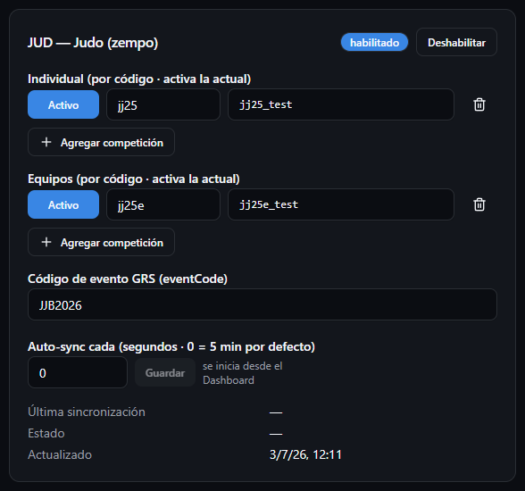

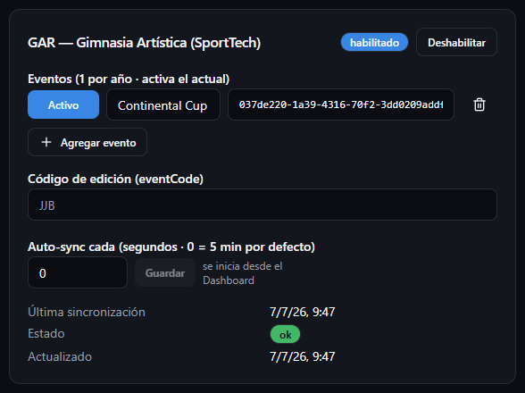

Pulsa **Guardar** cuando cambies algo (el botón aparece solo si hay cambios).

## 4. Dashboard

Es la página de inicio: una tarjeta por deporte con su estado en vivo (se refresca sola cada 15 segundos). Desde aquí se **enciende y apaga la auto-sync** de cada integración.

**WRE (lucha)** — estado de la auto-sync, evento configurado y URL de Arena. Botones **Iniciar** / **Detener** la auto-sync, **Sync completa** y **Resultados**.

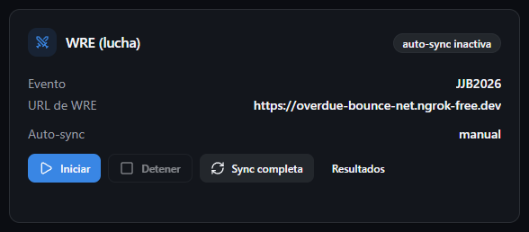

**JUD (judo)** — cuántas competiciones están en sync y cuáles son la individual y la de equipos activas. **Iniciar auto-sync** las agrega con los códigos de la configuración; también se puede quitar una competición de la lista.

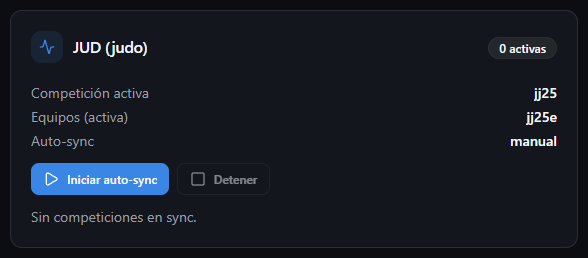

**ATH (atletismo)** — sincronizando / inactivo y última sincronización. **Iniciar** / **Detener**, **Sync manual** y la casilla *"Incluir sincronización de units"*.

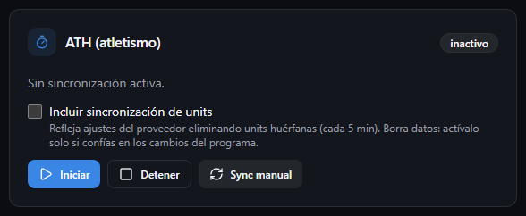

> ⚠️ En **ATH**, la casilla *"Incluir sincronización de units"* **borra** units huérfanas. Actívala solo si confías en los cambios del programa del proveedor.

**ARC (tiro con arco)** — solo monitor, sin acciones: recibiendo / sin datos, documentos ODF recibidos, último tipo y fecha.

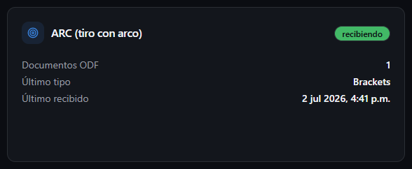

**SWM (natación)** — estado del webhook, última entrega y meet activo. **Sincronizar** un meet por su id.

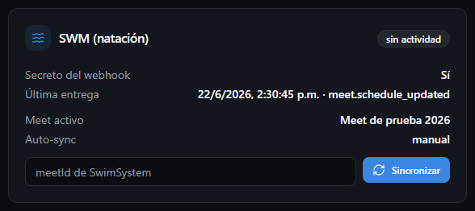

**GAR / GRY (gimnasia)** — dos tarjetas gemelas: evento activo y estado (manual / auto-sync activa / sincronizado). **Sincronizar** el evento (id pre-rellenado con el activo) e **Iniciar auto-sync** / **Detener**.

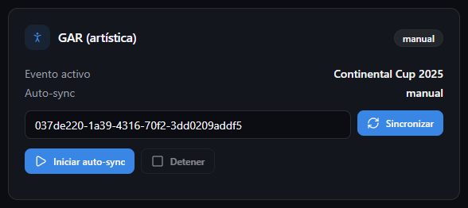

Si una tarjeta muestra *"No se pudo conectar…"*, usa el botón de reintento y, si persiste, revisa Configuración o avisa al equipo técnico.

## 5. Páginas por deporte

Las páginas comparten un patrón: pestaña de **competición/estado** (qué hay en el GRS), pestaña **Proveedor** (lo que manda el sistema externo, tal cual, para diagnóstico) y pestaña **Sync** (controles, pasos de setup e historial).

Varias páginas (WRE, SWM, GAR/GRY) comparten la tarjeta **Historial de sincronización**: última corrida, lista de corridas por etapa con su badge (ok / error) y los errores **agrupados por causa** (`N× causa` + "…y N más"); expande una causa para ver a qué unidades afecta.

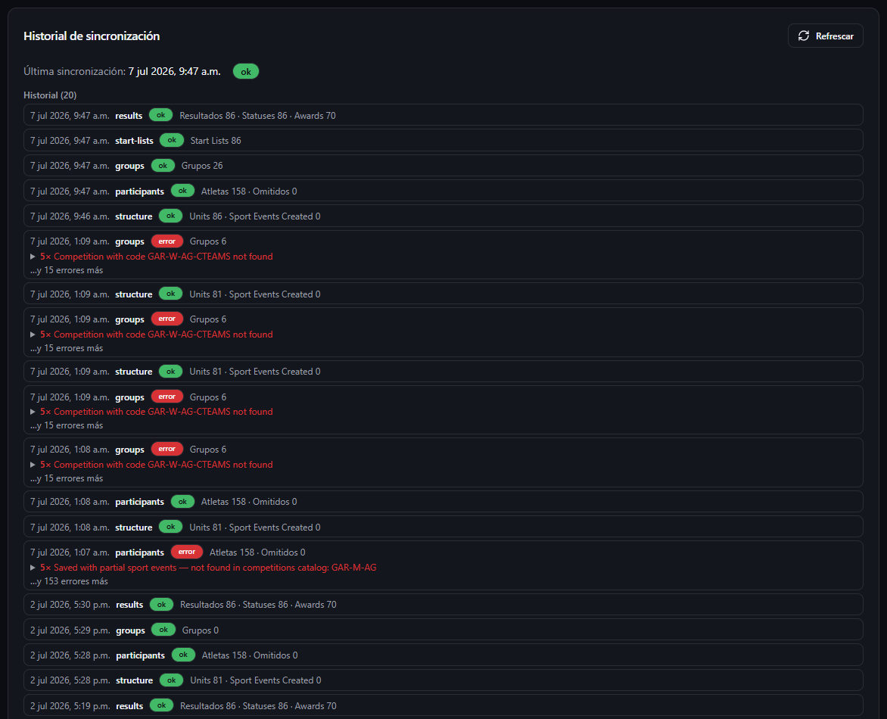

### 5.1 WRE (lucha) — Arena

Se actualiza **en vivo**: la página reacciona sola cuando Arena reporta cambios.

**Pestaña Competición.** La tarjeta *Evento actual* muestra sede, fechas y modalidad del evento activo de Arena:

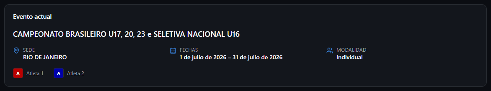

Debajo, las **Categorías** (con buscador) y las **Peleas** de la categoría seleccionada, agrupadas por ronda, con filtros Todas / Finalizadas / Pendientes y el área (tatami) de cada pelea. El botón **Sincronizar** re-sincroniza solo esa categoría:

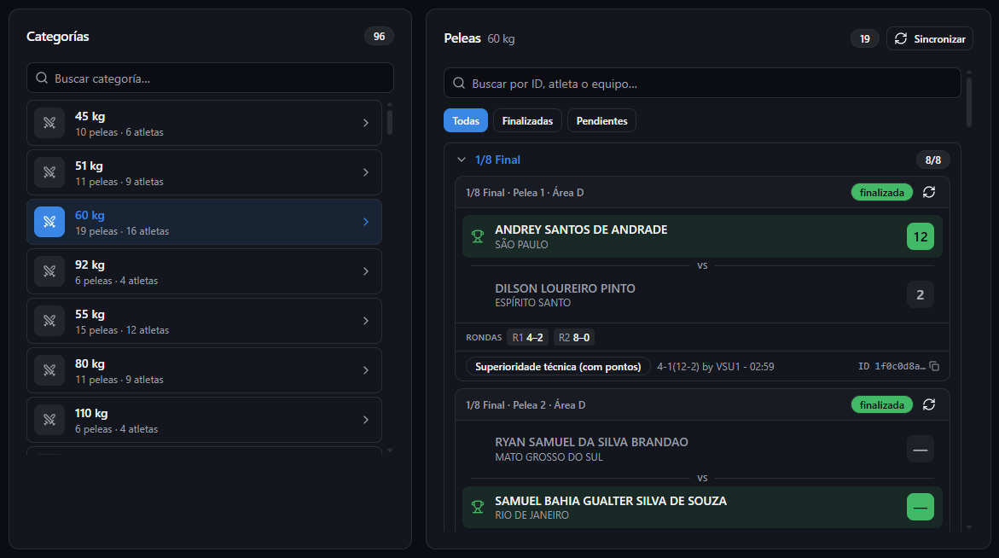

**Pestaña Proveedor.** Datos crudos de Arena (Evento / Categorías / Peleas) sin interpretación del GRS.

**Pestaña Sync.** Tres tarjetas y el historial:

- **Loop de sincronización**: sondeo periódico de respaldo del webhook (**Iniciar** / **Detener**).

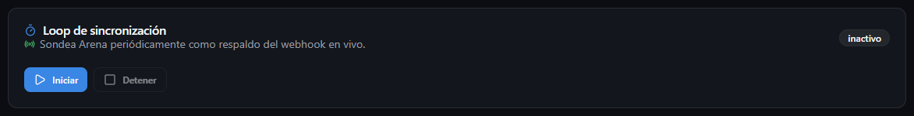

- **Webhook de Arena**: registra/activa/elimina el webhook con el que Arena avisa los cambios en vivo; muestra la URL receptora.

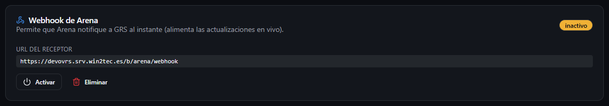

- **Setup en GRS**: crear estructura del evento → participantes → grupos → resultados.

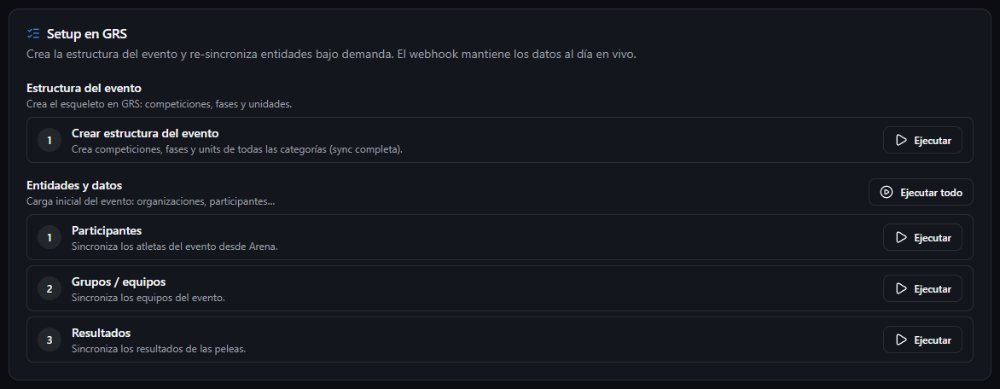

**Flujo típico al inicio del evento:** Configuración → WRE con Base URL y eventCode → pestaña Sync → ejecutar el setup → iniciar el loop. Después, la pestaña Competición es el monitor del día a día.

### 5.2 JUD (judo) — Zempo

Arriba de todo está la barra con el **código de competición** de Zempo, que usan todas las pestañas. Al lado del campo aparecen dos chips con los códigos configurados en Integraciones — **Individual** y **Equipos** — para ponerlos con un click sin re-tipear. Al escribir o elegir un código, la barra lo **valida en vivo** contra Zempo y muestra el nombre de la competición, cuántas categorías tiene (y cuántas sorteadas) y los inscritos:

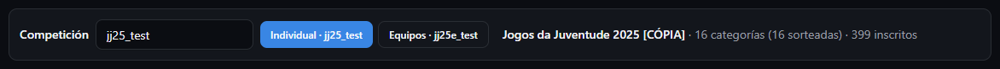

**Pestaña Configuración.** La tarjeta de setup ejecuta el flujo por fases desde Zempo hacia el GRS: crear estructura → participantes → start list → equipos → resultados → rankings, más staff y federaciones. El campo **Código de evento (eventCode)** viene pre-rellenado desde Integraciones. Cada paso tiene su botón **Ejecutar** y muestra un resumen (creados / procesados / omitidos) con errores si los hay; también se puede **Ejecutar todo** en orden:

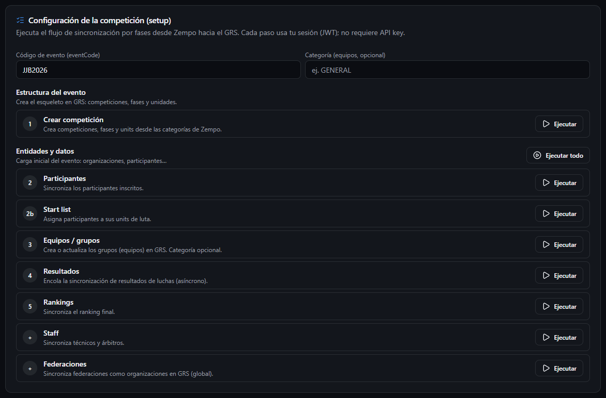

Al pie, la **Sincronización (zempo)**: activa/detiene el refresco periódico (cada 15 s) de una o varias competiciones:

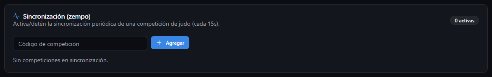

**Pestaña Lutas.** Categorías con su progreso (completadas/total) y las lutas de la categoría seleccionada. Como el nombre de las categorías se repite, cada fila muestra además el código del sport-event (el sufijo lleva el peso, p. ej. `14A1640`):

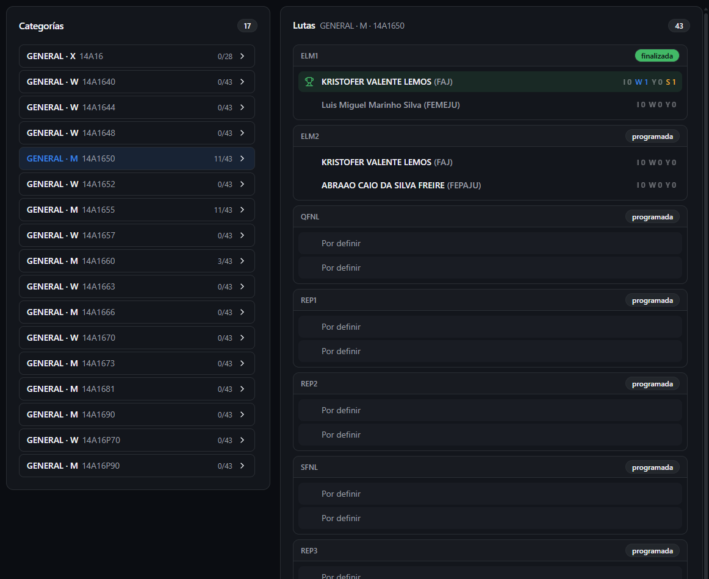

**Pestaña Orden de lutas.** Orden de ejecución por área (tatami), día y turno, con filtros:

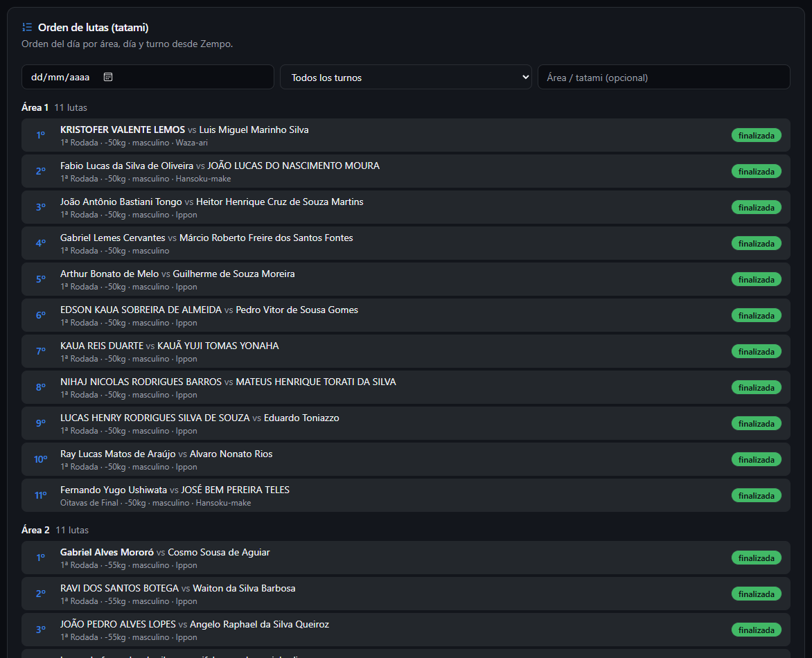

**Pestaña Resultados.** Pódio por categoría cuando la competición termina (mientras tanto, "Aún no hay resultados finales"):

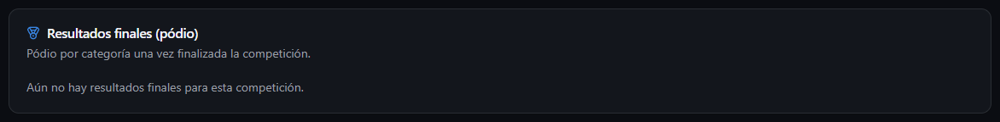

### 5.3 ATH (atletismo) — CBAT

**Loop de sincronización**: Iniciar / Detener el sync automático, con fecha y hora opcionales para sincronizar un día concreto:

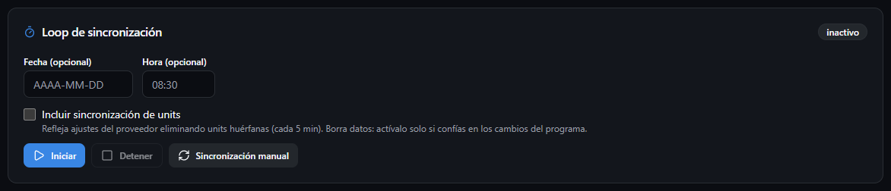

**Setup en GRS** en dos grupos, cada uno con su **Ejecutar todo**: *Estructura* (categorías → sport-events → competiciones → fases → unidades) y *Entidades* (organizaciones → participantes → grupos de relevos → medallas). Ejecuta en ese orden:

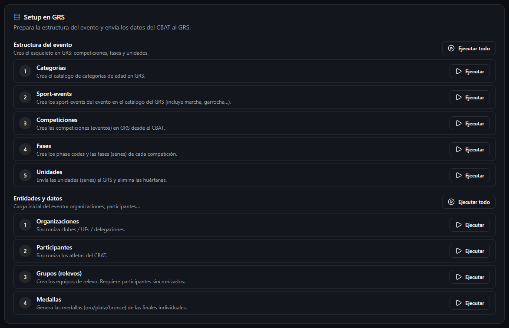

**Categorías del evento** y **Horarios de competición**: vistas de lectura de lo que envía el CBAT (pulsa **Cargar**), con filtro por fecha en los horarios.

### 5.4 ARC (tiro con arco) — IANSEO

Solo lectura: IANSEO empuja documentos ODF al GRS y esta página los monitorea.

**Pestaña Monitor de ingesta.** Tabla de documentos recibidos (filtrable por tipo: Brackets, Clasificación, Match); al seleccionar uno se ve su contenido tal como llegó:

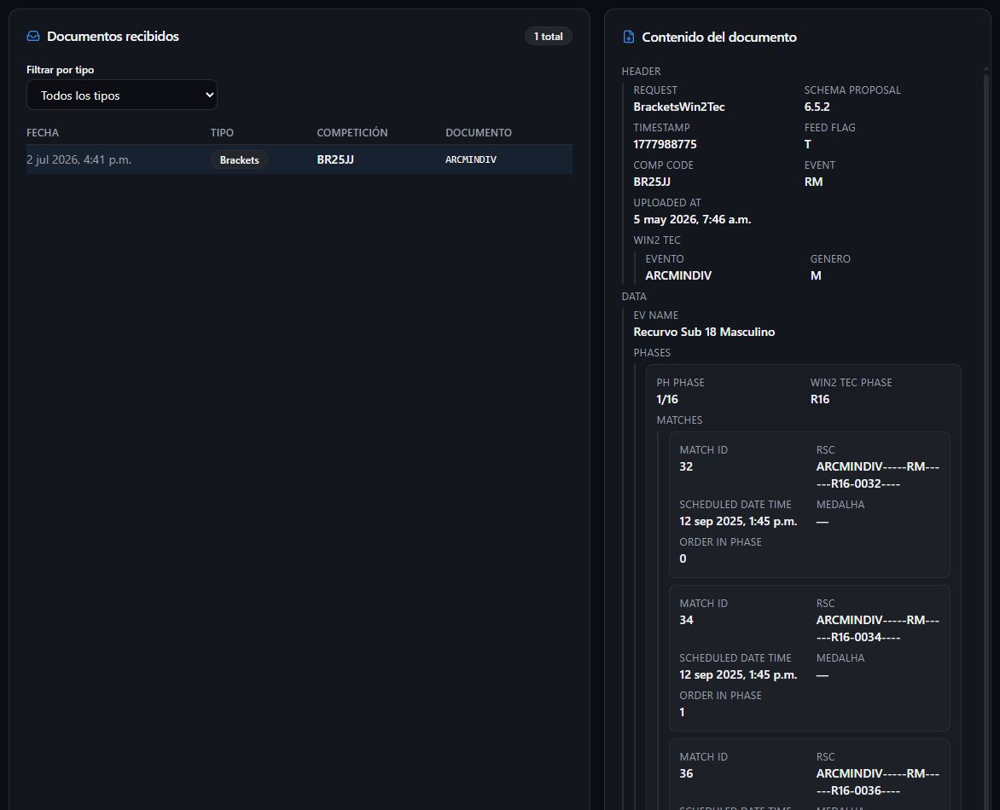

**Pestaña Competencia.** Categorías con su progreso y los matches de la seleccionada, agrupados por ronda, con marcador y ganador:

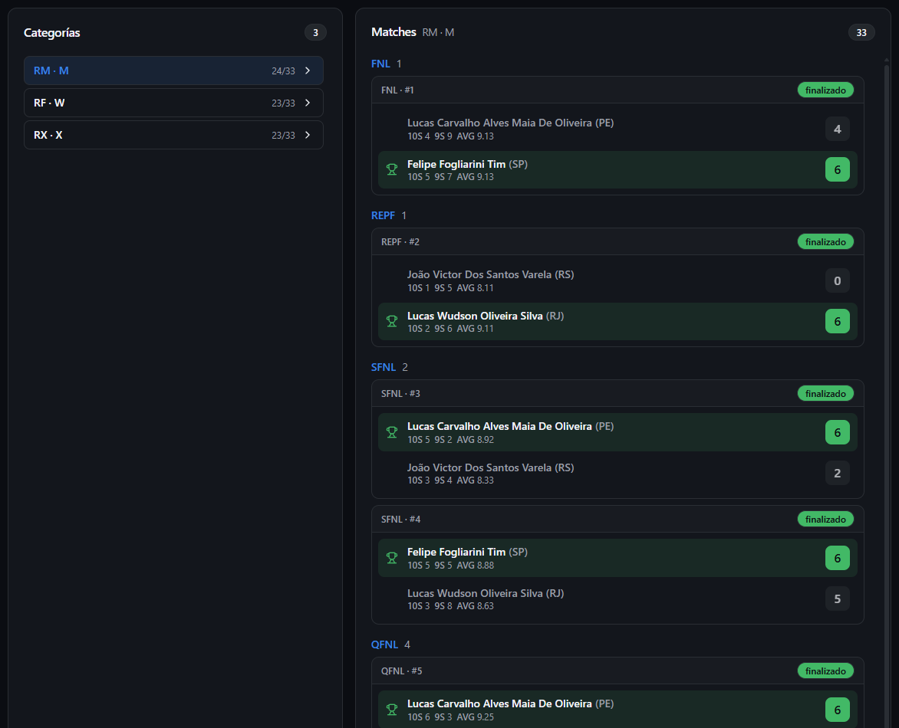

Si no llegan documentos ("sin datos" en el Dashboard), el problema está del lado de IANSEO o del webhook — no hay nada que "ejecutar" desde aquí.

### 5.5 SWM (natación) — SwimSystem

El meet activo se elige en **Configuración → Integraciones** (lista de meets con etiqueta y UUID).

**Pestaña Estado.** Estado de la conexión con SwimSystem y las **entregas de webhook** recientes, con contadores (completadas, fallidas, en espera) y el motivo cuando una falla:

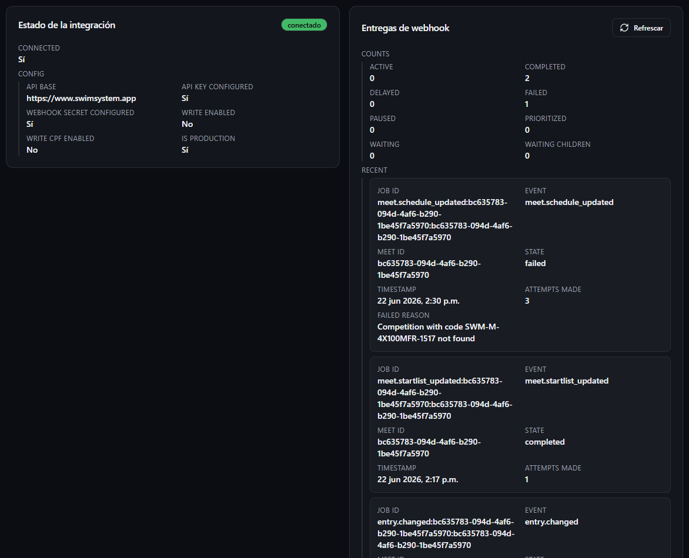

**Pestaña Proveedor.** Recursos crudos de SwimSystem (events, results, clubs, athletes, scoring, medals) con buscador:

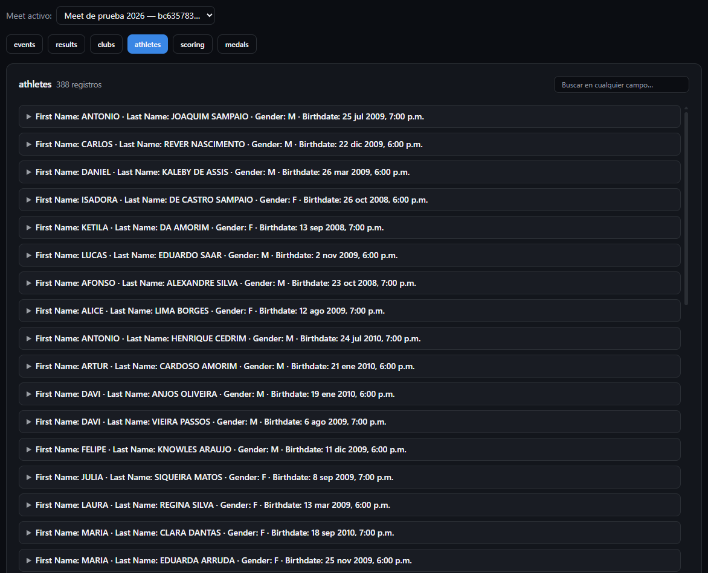

**Pestaña Sync.** Selector del meet activo, **Sincronizar meet**, **Validar (mapeo RSC)** y el sync por etapa en orden de dependencia: estructura → organizaciones → participantes → grupos (relevos) → start-lists → resultados (este último se dispara durante/después de la competencia, no en la carga inicial). Abajo, el historial:

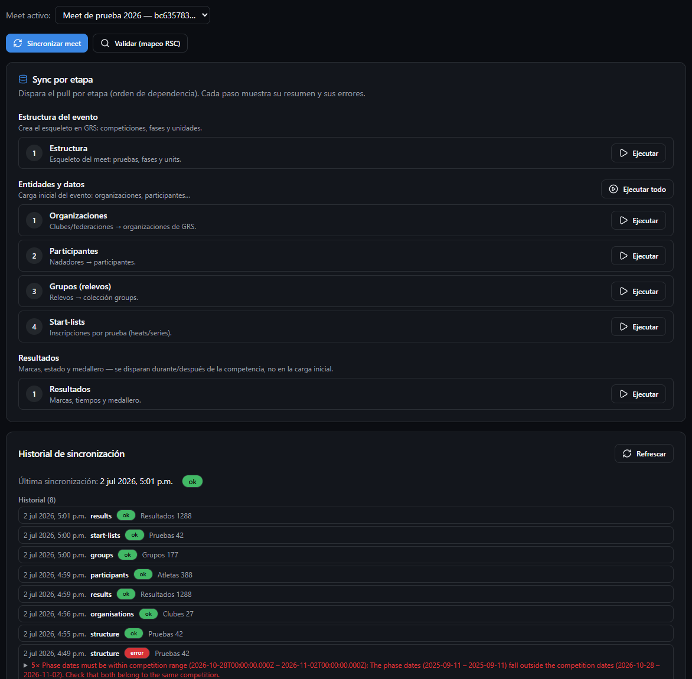

### 5.6 GAR / GRY (gimnasia) — SportTech

Dos páginas gemelas (artística y rítmica). Arriba se elige el **evento activo** (los eventos y sus etiquetas se administran en Configuración → Integraciones).

**Pestaña Competición.** Resumen del evento (competiciones, units, atletas, sin mapear) y una tarjeta por competición con sus units, indicando el RSC de cada una y cuáles ya están en catálogo y cuáles se crearán:

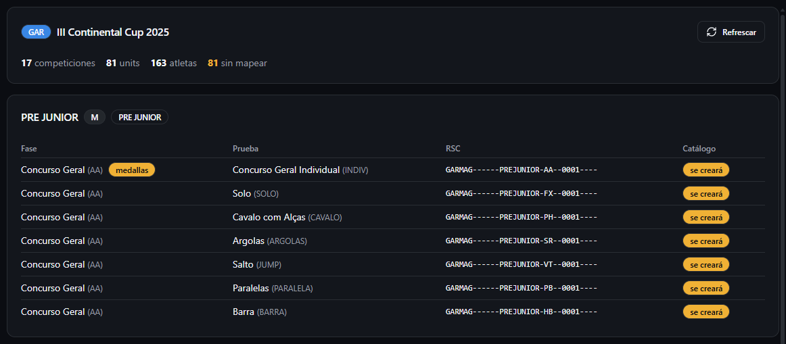

En rítmica, las competiciones de conjuntos aparecen con el badge **conjunto** y sus pruebas por equipos:

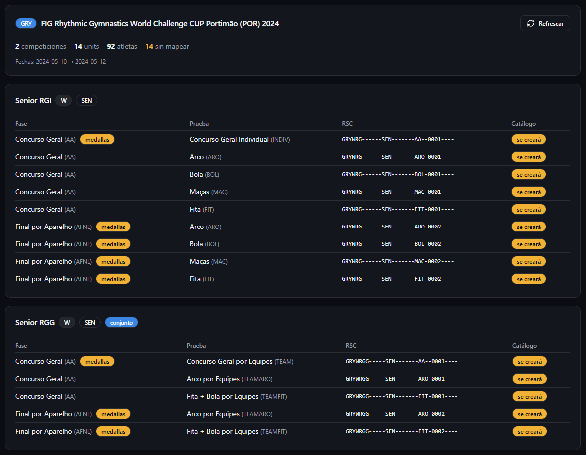

**Pestaña Proveedor.** Atletas, competiciones y estructura tal como los manda SportTech, con buscador:

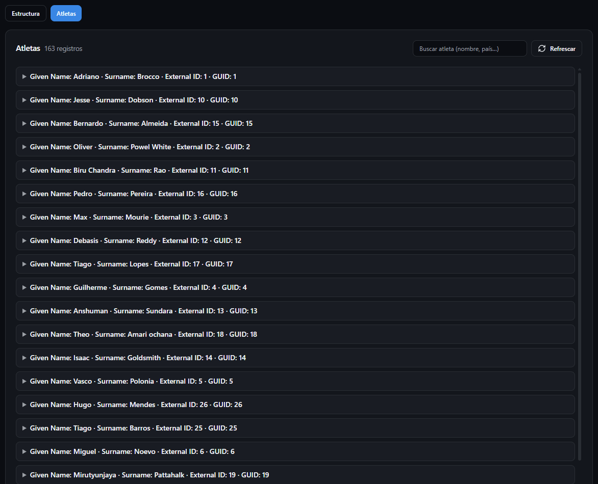

**Pestaña Sync.** El pull por etapa en orden de dependencia (estructura → participantes → grupos/conjuntos → start-lists → resultados → medallas), la importación por **CSV** como alternativa a la API, y el historial.

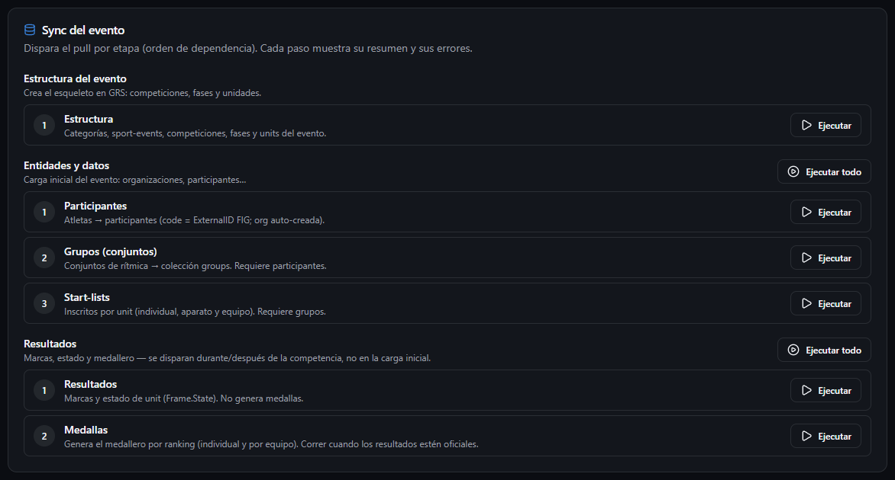

- **Start-lists** carga los inscritos por unit (individual, aparato y equipo); requiere haber corrido grupos.
- **Resultados** sincroniza marcas y estado de las units, pero **ya no genera el medallero**: eso lo hace el paso **Medallas**, que conviene correr cuando los resultados estén oficiales.

La **Ingesta por CSV** corre el pipeline completo (estructura → participantes → grupos → start-lists → resultados) desde un CSV de export del proveedor; detecta la disciplina del propio archivo y es idempotente:

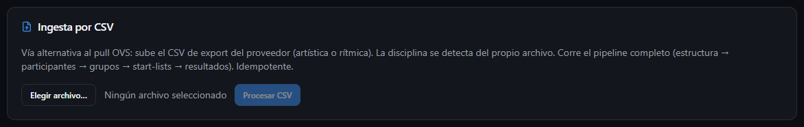

## 6. Puesta en marcha de un evento nuevo (checklist)

1. **Configuración → Conexiones**: URLs y API keys de los servicios. Guardar y probar Zempo.
2. **Configuración → Integraciones**: agregar la edición del año en cada proveedor (con su **etiqueta**), marcarla **Activo**, cargar eventCode/Base URL donde aplique y habilitar la integración. En JUD, cargar los códigos **Individual** y **Equipos** más el eventCode del GRS.
3. **Por deporte**: ejecutar el **setup** (estructura primero, entidades después) desde la pestaña Sync/Configuración de cada página.
4. **Activar los automáticos desde el Dashboard**: Iniciar auto-sync en las tarjetas de WRE, JUD, ATH, GAR/GRY (el intervalo se ajusta en Integraciones; `0` = cada 5 minutos).
5. **Monitorear desde el Dashboard** durante la competencia; entrar a la página del deporte solo para diagnóstico o re-sync puntual.

## 7. Problemas frecuentes

| Síntoma | Qué revisar |
|---|---|
| No puedo iniciar sesión | ¿GRS encendido? ¿URL correcta en Configuración → Conexiones? |
| Tarjeta con "No se pudo conectar" | Botón reintentar; luego URLs/keys en Conexiones y que el servicio esté corriendo |
| Estado **error** en una integración | Ver el campo **Error** en Configuración → Integraciones (los errores vienen agrupados por causa) o el historial de sync de la página del deporte |
| Los datos no coinciden con el proveedor | Pestaña **Proveedor** de la página del deporte: si lo crudo ya viene mal, el problema es del proveedor; si viene bien, re-ejecutar el paso de sync correspondiente |
| No aparece el evento del año | Falta agregarlo y marcarlo **Activo** en Configuración → Integraciones |
| La app pide login de nuevo | La sesión expiró: volver a entrar |
