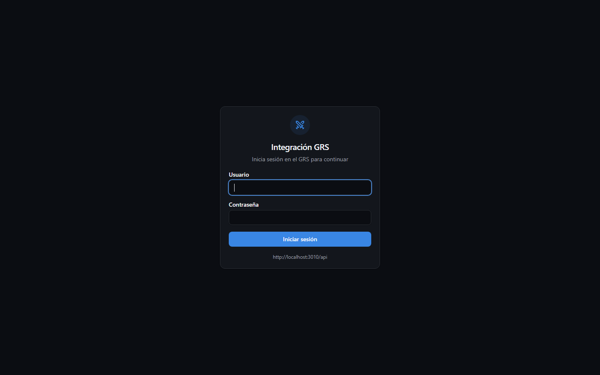
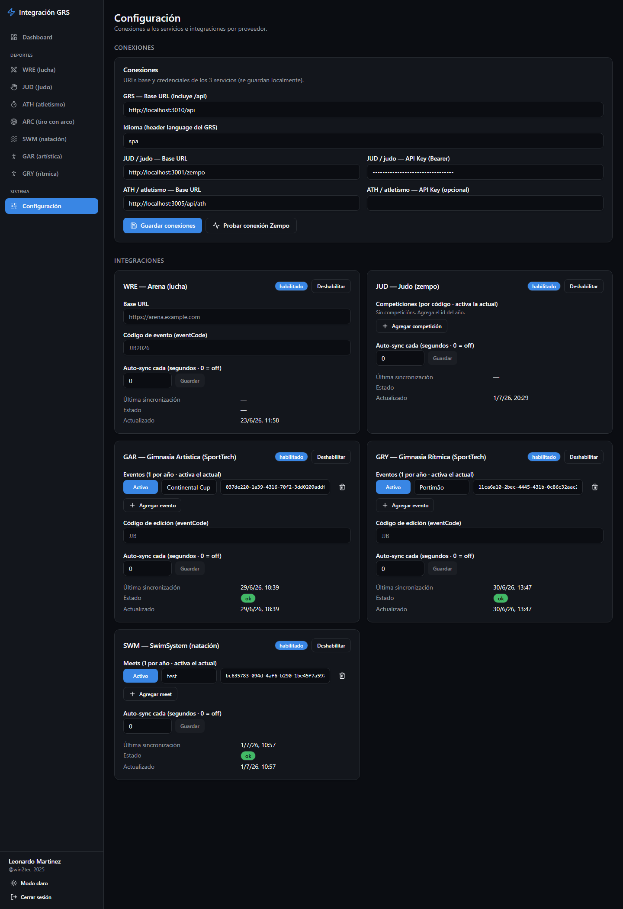
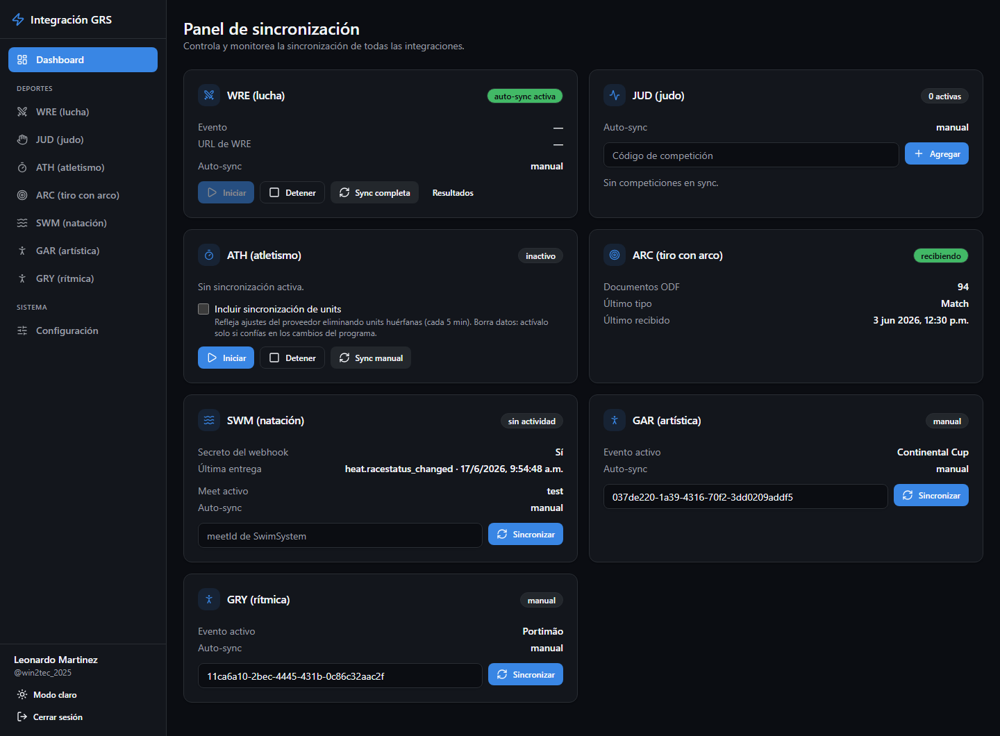
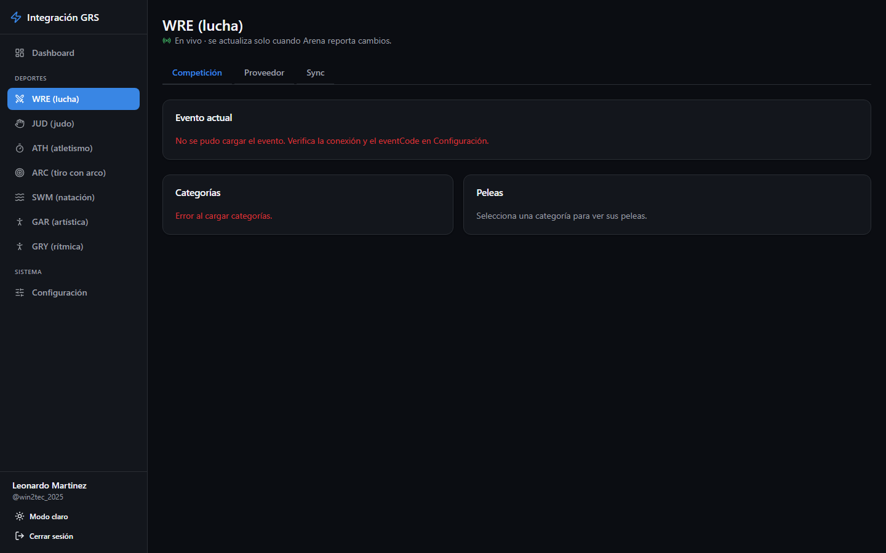
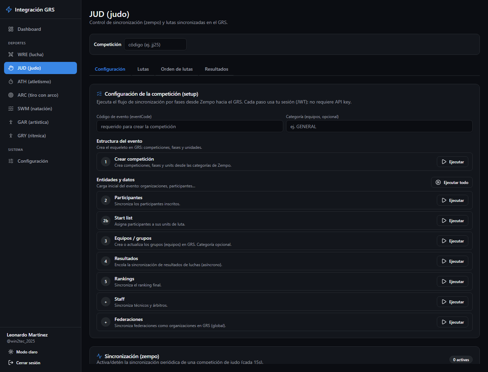
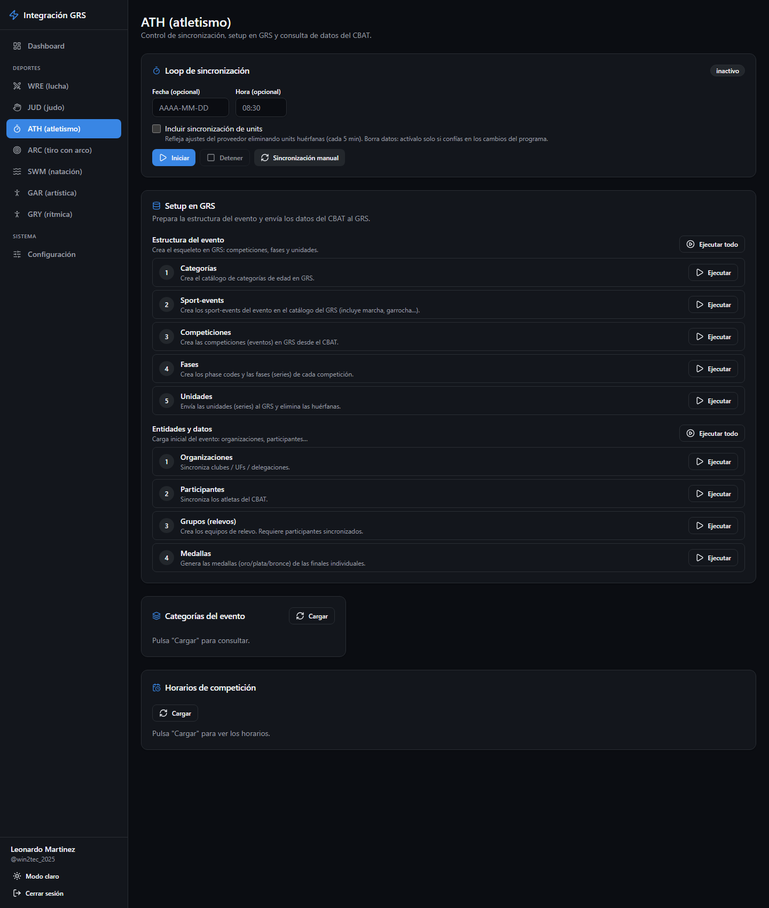
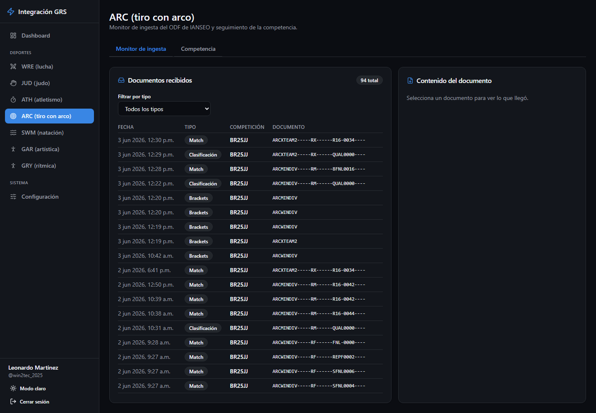
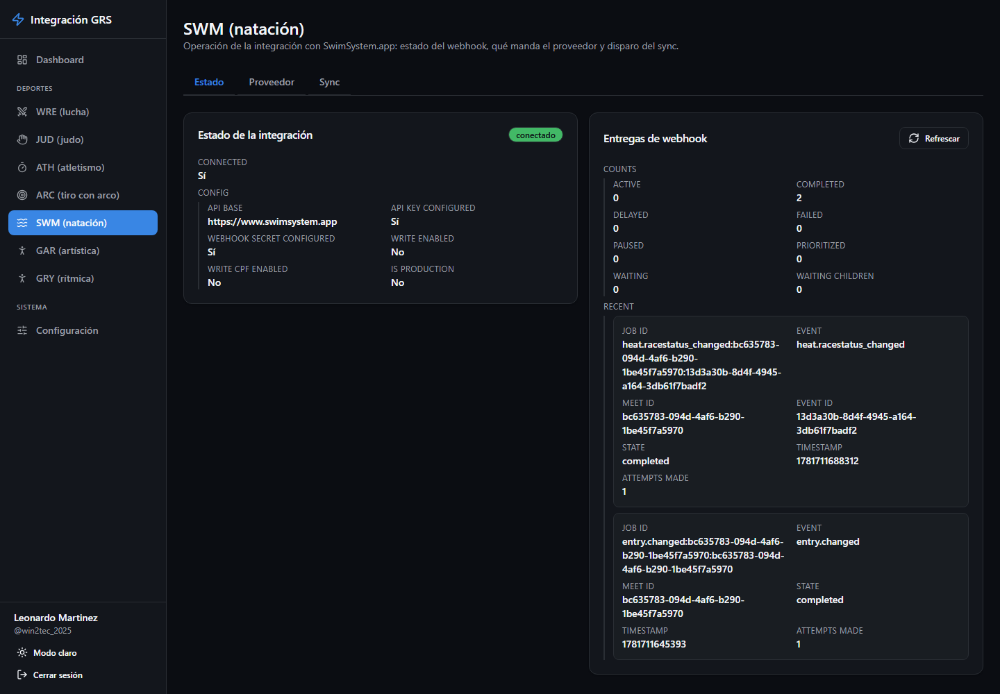
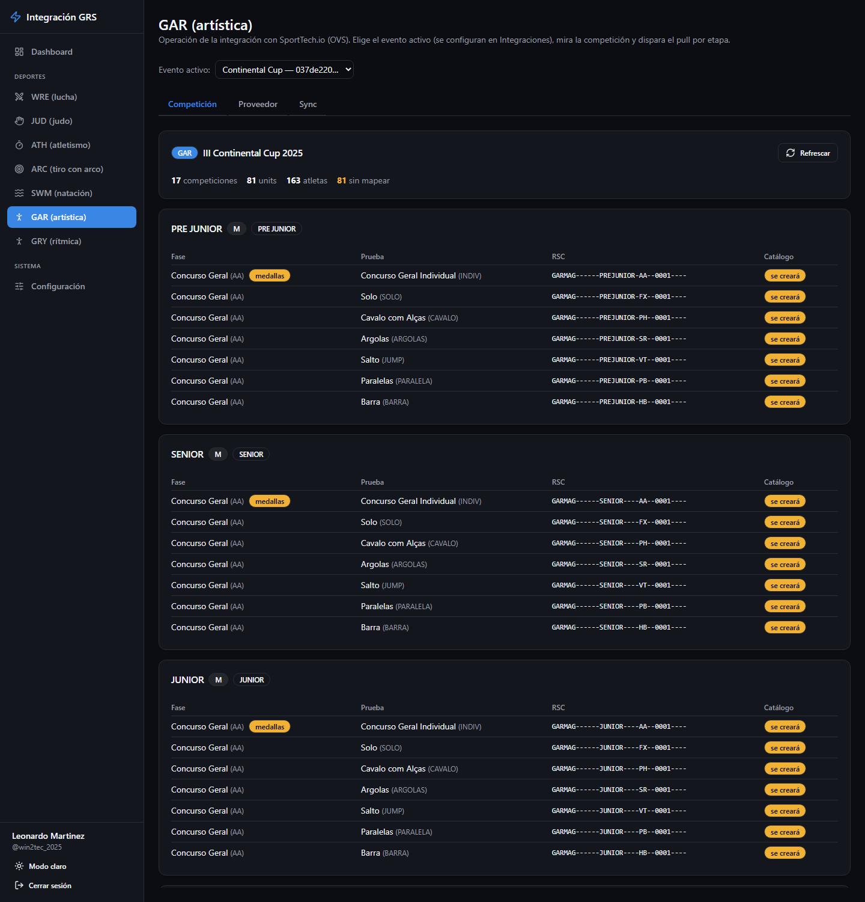
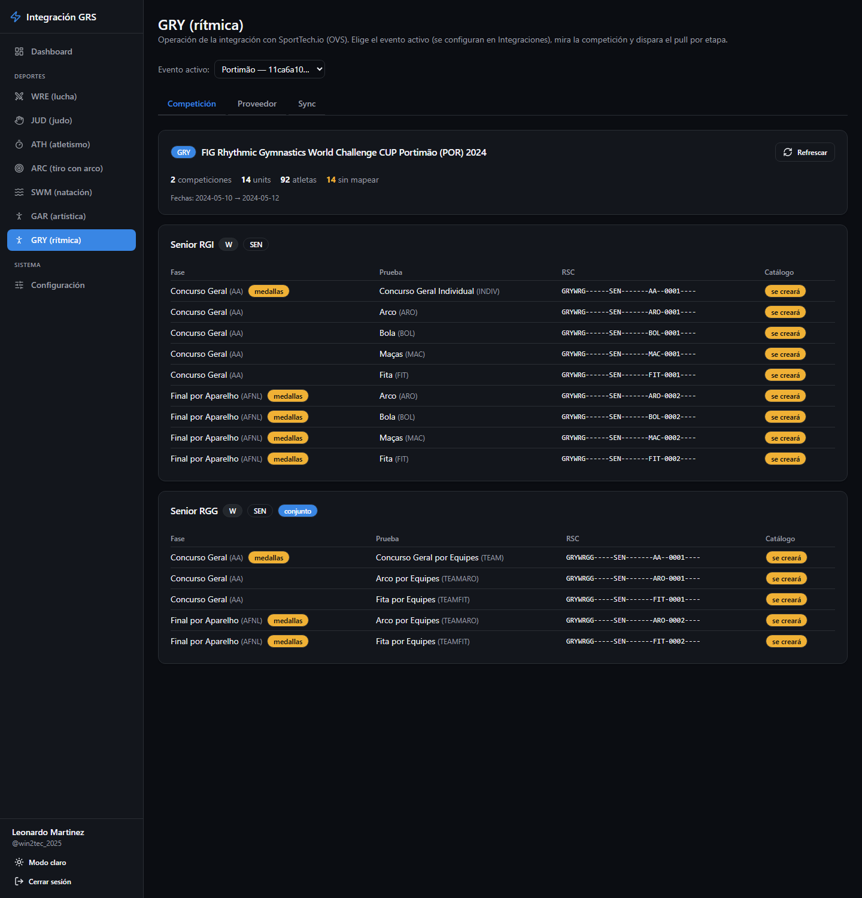

# Manual de usuario — Integración GRS

Panel de escritorio para operar la sincronización de resultados deportivos del evento **JJB2026** hacia el GRS. Cada deporte tiene su propia página; el **Dashboard** resume el estado de todos.

> **Glosario rápido**
> - **GRS**: el sistema central de resultados. Todo lo que se sincroniza termina ahí.
> - **Proveedor**: el sistema externo de cada deporte (Arena, Zempo, CBAT, IANSEO, SwimSystem, SportTech).
> - **Sync / sincronización**: traer datos del proveedor y guardarlos en el GRS.
> - **Auto-sync**: sincronización automática periódica (cada N segundos).
> - **Setup**: pasos que crean la estructura del evento en el GRS (competiciones, fases, units) antes de sincronizar datos.

---

## 1. Inicio de sesión

Al abrir la app aparece la pantalla **Integración GRS**.

1. Ingresa tu **Usuario** y **Contraseña** (credenciales del GRS).
2. Pulsa **Iniciar sesión**.

Al pie del formulario se muestra la URL del GRS a la que se conecta.

**Si algo falla:**
- *"Credenciales inválidas"* → usuario o contraseña incorrectos.
- *"No se pudo conectar con el GRS. Revisa la URL en Configuración."* → el GRS no responde; verifica la URL en **Configuración → Conexiones** o que el servidor esté encendido.

La sesión queda guardada localmente: al reabrir la app no hace falta volver a entrar mientras el token siga vigente. Si el token expira, la app vuelve sola al login.

## 2. Navegación

La barra lateral izquierda tiene tres bloques:

| Bloque | Entradas |
|---|---|
| (arriba) | **Dashboard** — resumen de todos los deportes |
| **Deportes** | WRE (lucha) · JUD (judo) · ATH (atletismo) · ARC (tiro con arco) · SWM (natación) · GAR (artística) · GRY (rítmica) |
| **Sistema** | **Configuración** — conexiones e integraciones |

Abajo del todo: tu usuario, el botón **Modo claro / Modo oscuro** y **Cerrar sesión**.

## 3. Configuración

Todo lo configurable vive en **Configuración**, en dos secciones.

### 3.1 Conexiones

Dónde están los servicios y sus credenciales. Se guardan **en esta computadora** (no en el servidor).

| Campo | Qué es |
|---|---|
| GRS — Base URL (incluye /api) | URL del GRS, p. ej. `http://localhost:3010/api` |
| Idioma (header language del GRS) | Código de idioma, normalmente `spa` |
| JUD / judo — Base URL y API Key | Servicio Zempo de judo |
| ATH / atletismo — Base URL y API Key (opcional) | Servicio de atletismo (CBAT) |

Pulsa **Guardar conexiones** al terminar. El botón **Probar conexión Zempo** verifica que el servicio de judo responda (badge "Zempo conectado" / "Zempo sin conexión").

### 3.2 Integraciones

Configuración operativa de cada proveedor, guardada en el GRS. Cada tarjeta (SWM, WRE, GAR, GRY, JUD) muestra:

- Badge **habilitado / deshabilitado** y botón para alternarlo.
- **Eventos / meets / competiciones**: la lista de ediciones (una por año). Agrega la actual y márcala como **activa** — es la que operan las páginas de cada deporte.
- **Auto-sync cada (segundos · 0 = off)**: intervalo del runner automático del servidor. Con un valor mayor a 0 aparece "runner activo · cada Xs".
- Campos propios del proveedor:
  - **WRE**: Base URL de Arena y **Código de evento (eventCode)**, p. ej. `JJB2026`.
  - **GAR/GRY**: **Código de edición (eventCode)**, p. ej. `JJB`.
- **Última sincronización**, **Estado** (badge) y **Error** del último intento — útil para diagnóstico.

Pulsa **Guardar** cuando cambies algo (el botón aparece solo si hay cambios).

## 4. Dashboard

Es la página de inicio: una tarjeta por deporte con su estado en vivo (se refresca sola cada 15 segundos).

| Tarjeta | Estado que muestra | Acciones rápidas |
|---|---|---|
| **WRE (lucha)** | auto-sync activa / inactiva, evento y URL | **Iniciar** / **Detener** auto-sync, **Sync completa**, **Resultados** |
| **JUD (judo)** | N competiciones en sync, competición activa | Agregar código de competición al sync, quitar una de la lista |
| **ATH (atletismo)** | sincronizando / inactivo, fecha y última sincronización | **Iniciar** / **Detener**, **Sync manual**, casilla "Incluir sincronización de units" |
| **ARC (tiro con arco)** | recibiendo / sin datos, documentos ODF recibidos | (solo monitor, sin acciones) |
| **SWM (natación)** | webhook activo / sin actividad, última entrega | **Sincronizar** un meet por su id |
| **GAR / GRY (gimnasia)** | manual / sincronizado / con errores | **Sincronizar** el evento por su id |

> ⚠️ En **ATH**, la casilla *"Incluir sincronización de units"* **borra** units huérfanas. Actívala solo si confías en los cambios del programa del proveedor.

Si una tarjeta muestra *"No se pudo conectar…"*, usa el botón de reintento y, si persiste, revisa Configuración o avisa al equipo técnico.

## 5. Páginas por deporte

Las páginas comparten un patrón: pestaña de **competición/estado** (qué hay en el GRS), pestaña **Proveedor** (lo que manda el sistema externo, tal cual, para diagnóstico) y pestaña **Sync** (controles, pasos de setup e historial).

### 5.1 WRE (lucha) — Arena

Se actualiza **en vivo**: la página reacciona sola cuando Arena reporta cambios.

- **Competición**: tarjeta *Evento actual* (código, fechas, estado), lista de **Categorías** con buscador, y las **Peleas** de la categoría seleccionada agrupadas por ronda. El botón **Sincronizar** re-sincroniza solo esa categoría.
- **Proveedor**: datos crudos de Arena (Evento / Categorías / Peleas) sin interpretación del GRS.
- **Sync**: loop de sincronización de respaldo (**Iniciar** / **Detener**), configuración del webhook, pasos de **Setup en GRS** (crear estructura del evento → participantes → grupos → resultados) e **historial de sync**.

**Flujo típico al inicio del evento:** Configuración → WRE con Base URL y eventCode → pestaña Sync → ejecutar el setup → iniciar el loop. Después, la pestaña Competición es el monitor del día a día.

### 5.2 JUD (judo) — Zempo

Arriba de todo está la barra con el **código de competición** de Zempo, que usan todas las pestañas.

- **Configuración**: tarjeta de setup de la competición (crear estructura → participantes → start list → equipos → resultados → rankings, más staff y federaciones) y control de horarios. Cada paso tiene su botón **Ejecutar** y muestra un resumen (creados / procesados / omitidos) con errores si los hay; también se puede **Ejecutar todo** en orden.
- **Lutas**: categorías con su progreso (completadas/total) y las lutas de la categoría seleccionada.
- **Orden de lutas**: orden de ejecución por tatami.
- **Resultados**: resultados y ranking.

### 5.3 ATH (atletismo) — CBAT

- **Loop de sincronización**: Iniciar / Detener el sync automático, con fecha y última sincronización.
- **Setup en GRS** en dos grupos: *Estructura* (categorías → sport-events → competiciones → fases → unidades) y *Entidades* (organizaciones → participantes → grupos de relevos → medallas). Ejecuta en ese orden.
- **Consulta de datos del CBAT**: vista de lectura de lo que envía el proveedor.

### 5.4 ARC (tiro con arco) — IANSEO

Solo lectura: IANSEO empuja documentos ODF al GRS y esta página los monitorea.

- **Monitor de ingesta**: tabla de documentos recibidos (filtrable por tipo: Clasificación, Brackets, Match); al seleccionar uno se ve su contenido.
- **Competencia**: categorías con su progreso y los matches de la seleccionada, agrupados por ronda.

Si no llegan documentos ("sin datos" en el Dashboard), el problema está del lado de IANSEO o del webhook — no hay nada que "ejecutar" desde aquí.

### 5.5 SWM (natación) — SwimSystem

Arriba se elige el **meet activo** (la lista se administra en Configuración → Integraciones).

- **Estado**: estado del webhook y últimas entregas recibidas.
- **Proveedor**: recursos crudos de SwimSystem con buscador.
- **Sync**: **Sincronizar meet**, **Validar (mapeo RSC)** y el sync por etapa en orden: estructura → organizaciones → participantes → grupos (relevos) → start-lists → resultados. Abajo, el historial.

### 5.6 GAR / GRY (gimnasia) — SportTech

Dos páginas gemelas (artística y rítmica). Arriba se elige el **evento activo**.

- **Competición**: resumen del evento (competiciones, units, atletas, sin mapear) y una tarjeta por competición con sus units, indicando cuáles ya están en catálogo y cuáles se crearán.
- **Proveedor**: atletas, competiciones y estructura tal como los manda SportTech, con buscador.
- **Sync**: pull por etapa (estructura → participantes → grupos/conjuntos → resultados), importación por **CSV** como alternativa a la API, e historial.

## 6. Puesta en marcha de un evento nuevo (checklist)

1. **Configuración → Conexiones**: URLs y API keys de los servicios. Guardar y probar Zempo.
2. **Configuración → Integraciones**: agregar la edición del año en cada proveedor, marcarla **activa**, cargar eventCode/Base URL donde aplique y habilitar la integración.
3. **Por deporte**: ejecutar el **setup** (estructura primero, entidades después) desde la pestaña Sync/Configuración de cada página.
4. **Activar los automáticos**: auto-sync de WRE y ATH, schedules de JUD, y el intervalo del runner en Integraciones donde se quiera sondeo periódico.
5. **Monitorear desde el Dashboard** durante la competencia; entrar a la página del deporte solo para diagnóstico o re-sync puntual.

## 7. Problemas frecuentes

| Síntoma | Qué revisar |
|---|---|
| No puedo iniciar sesión | ¿GRS encendido? ¿URL correcta en Configuración → Conexiones? |
| Tarjeta con "No se pudo conectar" | Botón reintentar; luego URLs/keys en Conexiones y que el servicio esté corriendo |
| Estado FAILED en una integración | Ver el campo **Error** en Configuración → Integraciones o el historial de sync de la página del deporte |
| Los datos no coinciden con el proveedor | Pestaña **Proveedor** de la página del deporte: si lo crudo ya viene mal, el problema es del proveedor; si viene bien, re-ejecutar el paso de sync correspondiente |
| No aparece el evento del año | Falta agregarlo y marcarlo **activo** en Configuración → Integraciones |
| La app pide login de nuevo | La sesión expiró: volver a entrar |
